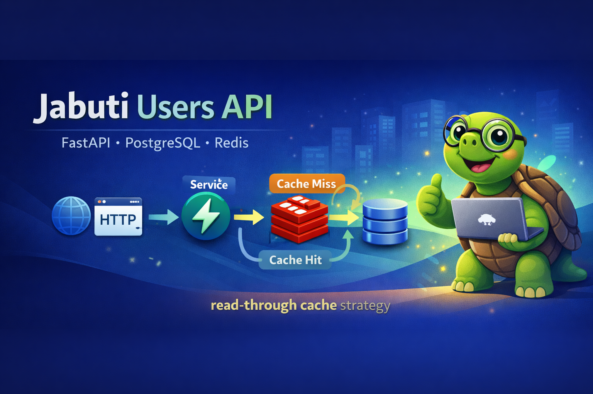

# 🐢 Jabuti Users API

>  **Users CRUD API** built with **FastAPI**, **PostgreSQL**, and **Redis** —
> designed to reflect real-world engineering practices.

---
<p align="center">
  
</p>

## 📌 Summary

| | |
|---|---|
| Framework | FastAPI 0.115+ (async-first) |
| Database | PostgreSQL 16 + SQLAlchemy 2 (async) |
| Migrations | Alembic |
| Cache | Redis 7 (read-through, auto-invalidation) |
| Validation | Pydantic v2 |
| Testing | pytest + pytest-asyncio (51 tests — unit + integration) |
| Quality | Ruff + mypy strict |
| Deploy | Docker Compose (3 services) |

---

## 📚 Table of Contents

- [📖 Overview](#-overview)
- [✅ Challenge Alignment](#-challenge-alignment)
- [🏗 Architecture](#-architecture)
- [📂 Project Structure](#-project-structure)
- [⚙️ Environment Variables](#️-environment-variables)
- [🛠 Makefile Commands](#-makefile-commands)
- [🐳 Running with Docker Compose](#-running-with-docker-compose)
- [🚀 Running Locally (without Docker)](#-running-locally-without-docker)
- [🗄 Database Migrations](#-database-migrations)
- [🧪 Tests](#-tests)
- [🧹 Lint & Type Checking](#-lint--type-checking)
- [🔌 API Endpoints](#-api-endpoints)
- [⚡ Cache Strategy](#-cache-strategy)
- [🧠 Design Decisions](#-design-decisions)
- [❓ Troubleshooting](#-troubleshooting)

---

## ✅ Challenge Alignment

Direct mapping between the case requirements and their corresponding implementations.

| Requirement | Implementation |
|------------|--------------|
| Full user CRUD | `POST /users`, `GET /users`, `GET /users/{id}`, `PUT /users/{id}`, `DELETE /users/{id}` — see `app/api/routers/users.py` |
| FastAPI | `app/main.py` with `create_app()` factory and lifespan handler |
| PostgreSQL | SQLAlchemy 2 async + asyncpg driver — `app/database/` |
| Migrations with Alembic | `alembic/versions/0001_create_users_table.py` creates `users` table with `uq_users_email` constraint |
| Redis (cache) | Cache-aside with automatic invalidation on all write operations — `app/cache/user_cache.py` |
| Docker Compose | 3 services (`db`, `cache`, `app`) with healthchecks and `depends_on` using `service_healthy` condition |
| Migrations on startup | `alembic upgrade head && uvicorn ...` in the `app` service command — fails fast if migration fails |
| Email uniqueness | Database constraint `uq_users_email` + `DuplicateEmailError` → HTTP 409 |
| Pagination | `GET /users?page=1&page_size=20` returning `total`, `page`, `page_size`, `items` |
| Payload validation | Pydantic v2 with `EmailStr`, `min_length`, `ge/le` — HTTP 422 for invalid payload |
| Unit tests | 35 tests using mocks for service, repository, and cache — no external dependencies |
| Integration tests | 16 tests in `tests/test_api_integration.py` — router → service → in-memory SQLite (no external infra) |


## � Makefile Commands

| Command | Description |
|---|---|
| `make init` | **First-time setup**: copy `.env` + build + start |
| `make env` | Copy `.env.example` → `.env` |
| `make build` | Build Docker images (no cache) |
| `make up` | Start containers in background |
| `make build-up` | Build and start containers in background |
| `make down` | Stop and remove containers |
| `make restart` | Restart the `app` container |
| `make logs` | Follow `app` container logs |
| `make test` | Run the full test suite |
| `make lint` | Run Ruff linter |
| `make fmt` | Run Ruff formatter |
| `make migrate` | Run `alembic upgrade head` inside the container |
| `make shell` | Open a bash shell inside the `app` container |

---

## �📖 Overview

This API manages a `User` entity with full CRUD over REST:

| Field   | Type   | Rules                 |
|---------|--------|-----------------------|
| `id`    | UUID   | Auto-generated        |
| `name`  | string | Required              |
| `email` | string | Required, unique      |
| `age`   | int    | Required, 0–150       |

Read endpoints are accelerated by a Redis cache layer with automatic invalidation on every write.

---

## 🏗 Architecture

### Request flow

```
HTTP Request
  → Router          (transport — no business logic)
    → Service       (orchestrates cache + repository)
      → Cache       (Redis read-through / invalidation)
      → Repository  (SQL only — no HTTP, no cache)
        → PostgreSQL
```

### Cache invalidation rules

| Operation | Cache cleared |
|-----------|--------------|
| `POST /users` | All `users:list:*` keys |
| `PUT /users/{id}` | `user:{id}` + all `users:list:*` keys |
| `DELETE /users/{id}` | `user:{id}` + all `users:list:*` keys |

Individual user cache TTL: **300 s** (configurable via `CACHE_TTL_SECONDS`)
List cache TTL: **60 s** (configurable via `CACHE_LIST_TTL_SECONDS`)

---

## 📂 Project Structure

```
.
├── app/
│   ├── api/
│   │   ├── dependencies.py       # FastAPI DI providers
│   │   └── routers/users.py      # CRUD endpoints
│   ├── cache/
│   │   ├── client.py             # Redis singleton
│   │   └── user_cache.py         # get / set / invalidate helpers
│   ├── core/
│   │   ├── config.py             # pydantic-settings (env vars)
│   │   ├── exceptions.py         # domain exception types
│   │   └── logging.py            # structured logging setup
│   ├── database/
│   │   ├── models.py             # SQLAlchemy ORM model
│   │   └── session.py            # async engine + session factory
│   ├── repositories/
│   │   └── user_repository.py    # data-access layer (SQL only)
│   ├── schemas/
│   │   └── user.py               # Pydantic request/response schemas
│   ├── services/
│   │   └── user_service.py       # business logic
│   └── main.py                   # app factory + lifespan handlers
├── alembic/
│   ├── versions/
│   │   └── 0001_create_users_table.py
│   └── env.py
├── tests/
│   ├── conftest.py
│   ├── test_user_cache.py
│   ├── test_user_repository.py
│   └── test_user_service.py
├── alembic.ini
├── docker-compose.yml
├── Dockerfile
├── pyproject.toml
├── .env.example
└── run.py                        # convenience local runner
```

---

## ⚙️ Environment Variables

Copy the example file before running anything:

```bash
cp .env.example .env
```

| Variable | Default           | Description |
|---|-------------------|---|
| `APP_ENV` | `development`     | Environment name |
| `APP_HOST` | `0.0.0.0`         | Bind host |
| `APP_PORT` | `8001`            | Bind port |
| `LOG_LEVEL` | `INFO`            | Logging level |
| `POSTGRES_HOST` | `localhost`       | PostgreSQL host |
| `POSTGRES_PORT` | `5432`            | PostgreSQL port |
| `POSTGRES_DB` | `jabuti_db`       | Database name |
| `POSTGRES_USER` | `jabuti_user`     | Database user |
| `POSTGRES_PASSWORD` | `jabuti_password` | Database password |
| `REDIS_HOST` | `localhost`       | Redis host |
| `REDIS_PORT` | `6379`            | Redis port |
| `REDIS_DB` | `0`               | Redis logical database |
| `CACHE_TTL_SECONDS` | `300`             | Per-user cache TTL |
| `CACHE_LIST_TTL_SECONDS` | `60`              | User-list cache TTL |

> **Note:** When running via Docker Compose, `POSTGRES_HOST`, `POSTGRES_PORT`,
> `REDIS_HOST`, and `REDIS_PORT` are **overridden automatically** by
> `docker-compose.yml` to use the internal service names (`db`, `cache`).
> You do **not** need to change these in `.env` for Docker.

---

## 🐳 Running with Docker Compose

This is the recommended way to run the full stack.

> **TL;DR — first time? Just run:**
> ```bash
> make init
> ```
> That's it. It copies `.env`, builds the images and starts everything.

If you prefer manual steps or don't have `make`:

```bash
cp .env.example .env
docker compose up --build
```

What happens automatically:

1. PostgreSQL starts and passes its health check
2. Redis starts and passes its health check
3. The app runs `alembic upgrade head` — creates the `users` table
4. Uvicorn starts on port `8001`

API: <http://localhost:8001>
Docs: <http://localhost:8001/docs>

### Subsequent runs (volume already exists)

```bash
docker compose up
```

> Migrations run on every startup. Alembic is idempotent —
> if the schema is already up to date, it does nothing.

### Stop the stack (keep data)

```bash
docker compose down
```

### ⚠️ Stop the stack AND wipe the database

```bash
docker compose down -v
```

> This destroys the `postgres_data` volume. **All data is lost.**
> The next `docker compose up` starts with an empty database.
> Alembic will automatically re-create the schema — the app is safe.

### Rebuild after code changes

```bash
docker compose up --build
```

### View logs

```bash
docker compose logs -f app    # app only
docker compose logs -f        # all services
```

### Verify all services are healthy

```bash
docker compose ps
```

All three services (`db`, `cache`, `app`) must show `healthy` before the API
is ready to serve requests. The `app` healthcheck uses Python's built-in
`urllib` (no extra dependencies required in the container).

---

## 🚀 Running Locally (without Docker)

Use this for faster development iteration with a local PostgreSQL and Redis.

### Prerequisites

- Python 3.12+
- PostgreSQL running locally
- Redis running locally

### Steps

```bash
# 1. Create and activate virtual environment
python -m venv .venv
source .venv/bin/activate        # Windows: .venv\Scripts\activate

# 2. Install runtime + dev dependencies
pip install -e ".[dev]"

# 3. Configure environment
cp .env.example .env
# Edit .env: set POSTGRES_HOST, POSTGRES_PORT, POSTGRES_USER,
#            POSTGRES_PASSWORD, POSTGRES_DB to match your local setup

# 4. ⚠️ Run database migrations (REQUIRED before first start)
alembic upgrade head

# 5. Start the API
python run.py
# or: uvicorn app.main:app --reload
```

API: <http://localhost:8001>
Docs: <http://localhost:8001/docs>

> **`alembic upgrade head` must be run before the first start and after
> every migration file is added.** Skipping this step causes
> `relation "users" does not exist` errors.

### Local PostgreSQL on a non-default port

If your local PostgreSQL listens on `5433` (common when Docker Postgres is
also installed), update `.env`:

```
POSTGRES_PORT=5433
```

---

## 🗄 Database Migrations

Migrations live in `alembic/versions/` and are managed by **Alembic**.

### Apply all pending migrations

```bash
alembic upgrade head
```

### Check current schema version

```bash
alembic current
```

### View full migration history

```bash
alembic history --verbose
```

### Roll back one step

```bash
alembic downgrade -1
```

### Roll back to empty database (drops `users` table)

```bash
alembic downgrade base
```

### Generate a migration after changing `models.py`

```bash
alembic revision --autogenerate -m "describe_your_change"
# Always review the generated file before applying
alembic upgrade head
```

> **Always commit migration files to version control.**
> They are the schema history — without them, the database cannot be
> reproduced in other environments.

---

## 🧪 Tests

The test suite is split into two layers:

**Unit tests** — `tests/test_user_service.py`, `test_user_repository.py`, `test_user_cache.py`
All dependencies (database session, Redis client) are mocked. No external services required.

**Integration tests** — `tests/test_api_integration.py`
Full HTTP request cycle: router → service → repository → SQLite in-memory database.
FastAPI dependency overrides replace PostgreSQL with SQLite (aiosqlite) and Redis with a no-op cache.
No external services required. Covers: create, get, list, update, delete, pagination, 404/409/422 errors, and the complete CRUD lifecycle.

```bash
# Run all tests (51 total)
pytest

# Verbose output
pytest -v

# Integration tests only
pytest tests/test_api_integration.py -v

# Unit tests only
pytest tests/test_user_service.py tests/test_user_repository.py tests/test_user_cache.py -v

# With coverage report
pytest --cov=app --cov-report=term-missing
```

Expected: **51 tests passing**.

---

## 🧹 Lint & Type Checking

```bash
# Linting
ruff check app/ tests/

# Auto-fix safe issues
ruff check app/ tests/ --fix

# Strict type checking
mypy app/

# Run all checks at once
ruff check app/ tests/ && mypy app/ && pytest
```

---

## 🔌 API Endpoints

Base URL: `http://localhost:8001`

| Method | Path | Description | Success | Error |
|--------|------|-------------|---------|-------|
| `GET` | `/users` | List users (paginated) | 200 | — |
| `GET` | `/users/{id}` | Get user by ID | 200 | 404 |
| `POST` | `/users` | Create user | 201 | 409, 422 |
| `PUT` | `/users/{id}` | Update user (partial) | 200 | 404, 409, 422 |
| `DELETE` | `/users/{id}` | Delete user | 204 | 404 |
| `GET` | `/health` | Health check | 200 | — |
| `GET` | `/docs` | Swagger UI | 200 | — |

### Pagination parameters

| Parameter | Default | Max | Description |
|-----------|---------|-----|-------------|
| `page` | `1` | — | 1-based page number |
| `page_size` | `20` | `100` | Items per page |

```
GET /users?page=2&page_size=10
```

### Example requests

```bash
# Create
curl -X POST http://localhost:8001/users \
  -H "Content-Type: application/json" \
  -d '{"name": "Alice", "email": "alice@example.com", "age": 30}'

# List
curl "http://localhost:8001/users?page=1&page_size=20"

# Get by ID
curl http://localhost:8001/users/<uuid>

# Update (partial — only send fields to change)
curl -X PUT http://localhost:8001/users/<uuid> \
  -H "Content-Type: application/json" \
  -d '{"name": "Alice Updated"}'

# Delete
curl -X DELETE http://localhost:8001/users/<uuid>
```

---

## ⚡ Cache Strategy

The API uses the **cache-aside (lazy loading)** pattern.

**On reads (`GET`):**

1. Check Redis for a cached response
2. Cache hit → return immediately (no DB query)
3. Cache miss → query PostgreSQL → populate cache → return

**On writes (`POST`, `PUT`, `DELETE`):**

1. Write to PostgreSQL and **commit**
2. Invalidate related cache keys in Redis

The commit always happens **before** cache invalidation. This prevents a race
condition where a concurrent read could populate the cache with uncommitted data.

**Cache keys:**

| Key pattern | Content | TTL |
|-------------|---------|-----|
| `user:{uuid}` | Single user JSON | 300 s |
| `users:list:page={p}:size={s}` | Paginated list JSON | 60 s |

**Resilience:** Redis errors are caught and logged as warnings.
The API continues to serve requests directly from PostgreSQL if Redis is unavailable.

---

## 🧠 Design Decisions

**Why `commit()` inside the repository, not in the session teardown?**

Write operations commit explicitly inside the repository before returning.
This guarantees that PostgreSQL has durably stored the data before the service
layer invalidates the cache. Without this ordering, a concurrent `GET` could
miss the cache, query the database before the commit, and re-populate the cache
with missing or stale data.

**Why two TTL settings for cache?**

List responses are more volatile — any write invalidates every page. A shorter
TTL (60 s) limits the inconsistency window if cache invalidation fails silently
(e.g. Redis is temporarily unreachable during a write). Individual user records
use 300 s since they are invalidated precisely by ID on update/delete.

**Why Alembic instead of `create_all`?**

`Base.metadata.create_all` creates tables but has no concept of schema evolution.
Alembic tracks every change as a versioned, reviewable, reversible migration file —
the schema can be upgraded, downgraded, and reproduced identically in any environment.

---

## ❓ Troubleshooting

### `relation "users" does not exist`

The `users` table has not been created. Causes:

- You deleted the Docker volume (`docker compose down -v`) and restarted without rebuilding
- You are running locally and skipped `alembic upgrade head`
- The migration failed silently (check app logs: `docker compose logs app`)

**Fix — Docker:**

```bash
docker compose down           # stop containers (keeps volume)
docker compose up --build     # migrations run automatically on startup
```

If the volume is corrupted or you want a clean slate:

```bash
docker compose down -v        # ⚠️ destroys all data
docker compose up --build
```

**Fix — Local:**

```bash
alembic upgrade head
```

---

### App starts but cannot connect to PostgreSQL

```bash
# Docker: verify all services are healthy
docker compose ps

# Local: check PostgreSQL is accepting connections
pg_isready -h localhost -p 5432 -U jabuti_user

# Check your .env matches the actual database configuration
cat .env
```

---

### Port already in use (`address already in use`)

```bash
# Find the process using the port
lsof -i :8001
lsof -i :5432
lsof -i :6379

# Or change the exposed port in .env (Docker only — internal ports stay the same)
APP_PORT=8001
POSTGRES_PORT=5433
REDIS_PORT=6380
```

---

### Code changes not reflected in Docker

The image must be rebuilt after any source code change:

```bash
docker compose up --build
```

---

### `ModuleNotFoundError: No module named 'app'`

Always run commands from the **project root**, not from inside `app/`:

```bash
cd /path/to/fastapi-jabuti-ia   # project root
pytest                           # ✅
alembic upgrade head             # ✅
python run.py                    # ✅
```

---

### Tests fail with `ModuleNotFoundError` or import errors

```bash
# Ensure the venv is active and dependencies are installed
source .venv/bin/activate
pip install -e ".[dev]"
pytest
```

---

## 🚧 Out of Scope — Potential Future Improvements

The following features were intentionally left out as they fall outside the scope of this project (a focused Users CRUD API), but would be natural next steps in a production system:

### 🔐 Authentication & Authorization

- **JWT authentication** — issue signed access/refresh tokens on login and validate them via a FastAPI dependency on protected routes
- **Password hashing** — store passwords with `bcrypt` or `argon2`; never expose them in responses
- **Ownership enforcement** — inject the authenticated user into route dependencies so that `PUT /users/{id}` and `DELETE /users/{id}` only succeed when `current_user.id == user_id` (or the caller has an admin role)
- **Role-based access control (RBAC)** — introduce a `role` field (`admin`, `user`) and guard sensitive endpoints accordingly
- **OAuth2 / social login** — delegate authentication to an identity provider (Google, GitHub) via the OAuth2 authorization code flow

### 📧 Email & Account Lifecycle

- **Email verification** — send a confirmation link after registration and block login until the address is verified
- **Password reset flow** — generate a short-lived signed token, deliver it by email, and allow the user to set a new password
- **Soft delete** — add a `deleted_at` timestamp instead of hard-deleting rows, preserving audit history
- **Account deactivation** — allow users to deactivate their own accounts without permanently removing data

### 🛡️ Security Hardening

- **Rate limiting** — throttle endpoints (especially login and registration) with `slowapi` or an API gateway to prevent brute-force and spam
- **HTTPS / TLS termination** — terminate TLS at a reverse proxy (Nginx, Traefik) in front of the application
- **CORS configuration** — restrict allowed origins to trusted front-end domains instead of a wildcard
- **Request ID tracing** — attach a unique `X-Request-ID` header to every request for distributed tracing

### 📊 Observability

- **Structured JSON logging** — emit logs as JSON for ingestion by log aggregators (Datadog, Loki, CloudWatch)
- **Metrics** — expose a `/metrics` endpoint with Prometheus counters and histograms for request latency and cache hit rates
- **Health checks** — add `/healthz` (liveness) and `/readyz` (readiness) endpoints that verify DB and Redis connectivity
- **Distributed tracing** — instrument with OpenTelemetry to trace requests across services

### ⚙️ API & Data Quality

- **Cursor-based pagination** — replace offset pagination with cursor-based pagination for stable, efficient traversal of large datasets
- **Field-level validation** — enforce stricter rules (e.g., disposable email blocklist, name character whitelist)
- **API versioning** — prefix routes with `/v1/` to allow non-breaking evolution of the contract
- **OpenAPI enhancements** — add detailed response examples and error schemas to the auto-generated docs
